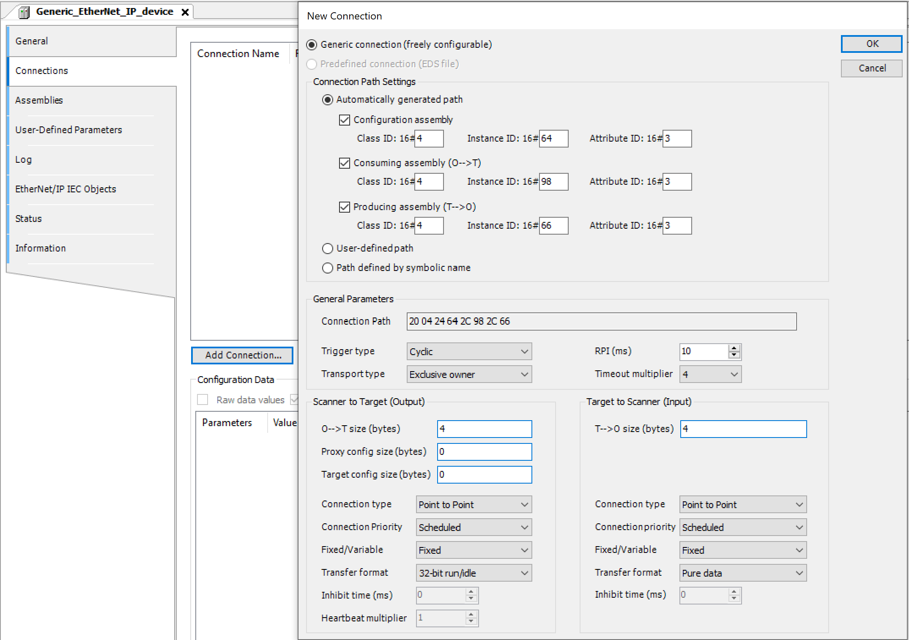
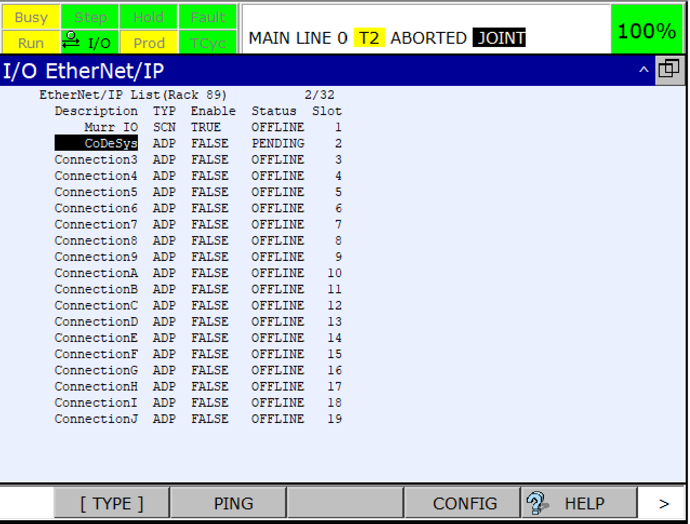
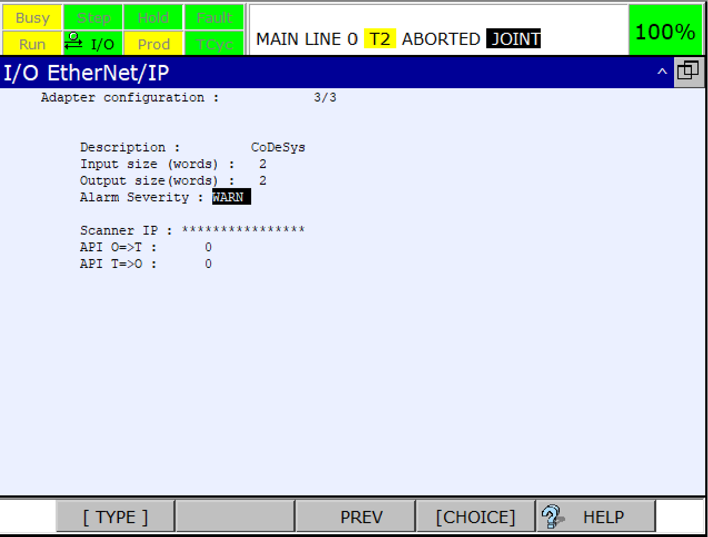
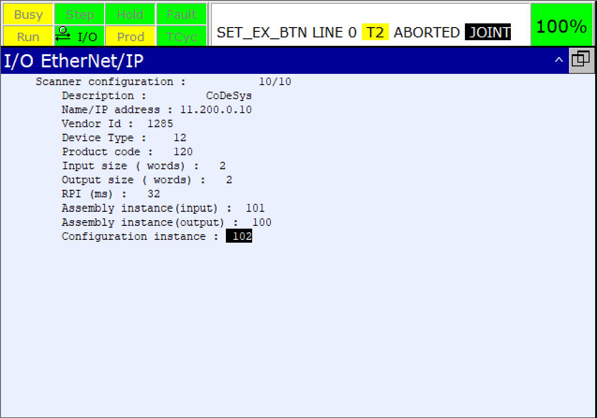
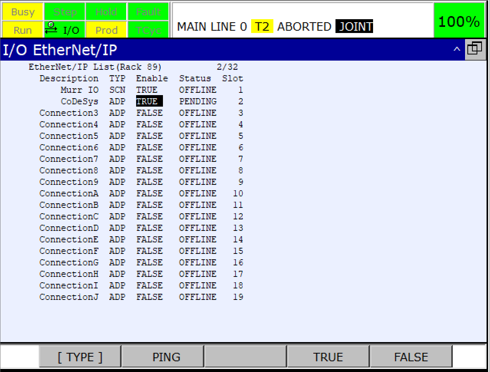
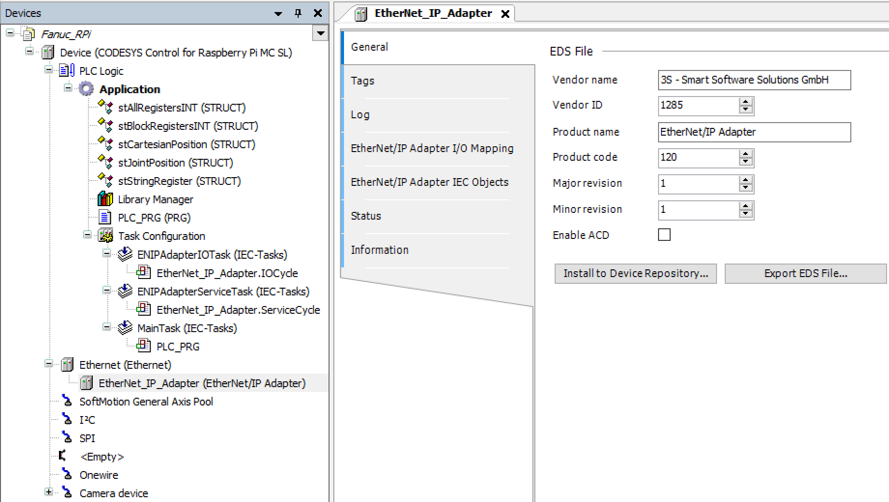
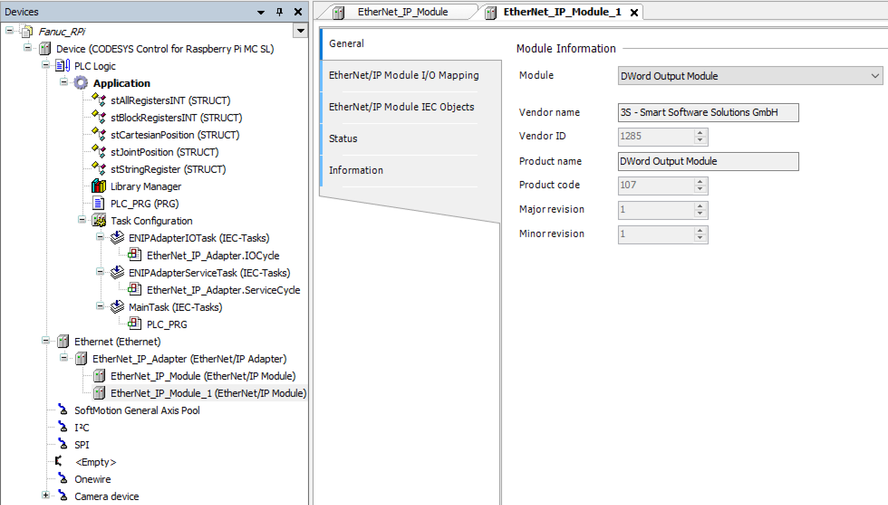

# Set up Discrete I/O Communication
Quick tutorial on how to set up I/O between your CoDeSys controller and the Fanuc robot controller using implicit messaging

### CoDeSys Scanner <=> Fanuc Adapter

#### CoDeSys
1) 
    1) Right click on your controller device (e.g. CODESYS Control for Raspberry Pi MC SL)
        1) Select `Add device`
        2) Expand `Ethernet Adapter` and select `Ethernet`
        3) Click `Add Device`
    2) Double click the newly added `Ethernet (EtherNet)` device
        1) In the `General` tab, press `...` to select the controller's Ethernet network interface
2) 
    1) Right click the newly added `Ethernet (Ethernet)` device
        1) Select `Add device`
        2) Expand `EtherNet/IP` -> `EtherNet/IP Scanner` and select `EtherNet/IP Scanner`
        3) Click `Add Device`
    2) Right click the newly added `Ethernet_IP_Scanner (EtherNet/IP Scanner)` device
        1) Select `Add device`
        2) Select `Generic EtherNet/IP Device`
        3) Click `Add Device`
    3) Double click on the newly added `Generic_EtherNet_IP_device (Generic EtherNet/IP Device)` device
        1) In the `General` tab, enter the IP address of the robot controller
3) 
    1) Select the `Connections` tab and click `Add Connection...`
    2) Check `Configuration assembly` and enter `64` for Instance ID.  This is hex value for `100` in decimal
    3) Check `Consuming assembly (O-->T)` and enter `98` for Instance ID.  This is hex value for `152` in decimal
        1) **NOTE:**  Example uses slot 2 on robot controller.  Change value to `97` hex / `151` decimal for slot 1, or `99` hex / `153` decimal for slot 3, etc.
    4) Check `Configuration assembly` and enter `66` for Instance ID.  This is hex value for `102` in decimal
        1) **NOTE:**  Example uses slot 2 on robot controller.  Change value to `66` hex / `102` decimal for slot 1, or `67` hex / `103` decimal for slot 3, etc.
    5) Modify:
        1) The RPI if needed.  Default is `10ms`
        2) `O-->T size (bytes)` is CoDeSys's output to Fanuc's input.  Example uses 2 words, which can control 32 Fanuc input bits
        3) `T-->O size (bytes)` is Fanuc's output to CoDeSys's input.  Example uses 2 words, which can control 32 CoDeSys input bits
        4) `Connection type` to `Point to Point`
        5) `Connection Priority` to `Scheduled`.
        6) `Fixed/Variable` to `Fixed`
        7) `Transfer format` of `Scanner to Target (Output)` to `32-bit run/idle`, and `Transfer format` of `Target to Scanner (Input)` to `Pure data`
        8) Click `OK`

#### Fanuc
1) 
    1) On the teach pendant, press `Menu`
    2) Use arrow key and navigate to `5 I/O` -> `EtherNet/IP`
2) 
    1) Select the slot number for usage
        1) Optional: press enter to change the default description of `ConnectionX`.  Example uses slot 2
    2) Make sure TYP column is set to `ADP`
    3) Highlight the device under the Description column and press `CONFIG` or `F4`.
        1) Make sure Enable is set to `FALSE` to modify values
3) 
    1) Change `Input size (words)` to 2, and repeat the same for `Output size (words)`.  Example is to control 32 bits (4 bytes / 2 words), but you can adjust to fit your application
    2) Use `[CHOICE]` or `F4` to adjust `Alarm Severity` if needed.
        1) Default is `WARN`, `PAUSE` or `STOP` will stop the robot motion if EtherNet/IP fault occurs
    3) Press `PREV` or `F3`
4) 
    1) Change Enable from `FALSE` to `TRUE`
5) 
    1) On the teach pendant, press `Menu`
    2) Use arrow key and navigate to `5 I/O` -> `3 Digital`.  Example controls bits, but you can change to `5 Group`.
6) 
    1) Start with `I/O Digital Out`.  If you do not see this screen, press `IN/OUT` or `F3` to switch screen
    2) Press `CONFIG` or F2
    3) Change range, example uses DO[1- 32].
    4) Set `RACK` to 89, which is EtherNet/IP
    5) Set SLOT, example uses slot 2.
    6) Set START, example uses full range so start index is 1
    7) Press `IN/OUT` for `F3` to switch to `I/O Digital In` and repeat the steps from above
7) Power cycle the controller to apply settings
    
### Fanuc Scanner <=> CoDeSys Adapter

#### Fanuc
1) 
    1) On the teach pendant, press `Menu`
    2) Use arrow key and navigate to `5 I/O` -> `EtherNet/IP`
2) 
    1) Select the slot number that is available for usage
        1) Optional: press enter to change the default description of `ConnectionX`.  Example uses slot 2
    2) Make sure TYP column is set to `SCN`
    3) Highlight the device under the Description column and press `CONFIG` or `F4`.
        1) Make sure Enable is set to `FALSE` to modify values
3) 
    1) For `Name/IP address`, enter the IP address of the CoDeSys controller
    1) For `Vendor Id`, enter `1285` (optional, could leave as 0)
    2) For `Device Type`, enter `12` (optional, could leave as 0)
    3) For `Product Code`, enter `120` (optional, could leave as 0)
    4) Change `Input size (words)` to 2, and repeat the same for `Output size (words)`.  Example is to control 32 bits (4 bytes / 2 words), but you can adjust to fit your application
    5) Adjust RPI if needed
    6) Change `Assembly instance (input)` to 101
    7) Change `Assembly instance (output)` to 100
    8) Change `Configuration instance)` to 102 (optional, could leave as 0)
    9) Press `PREV` or `F3`
4) 
    1) Change Enable from `FALSE` to `TRUE`
5) 
    1) On the teach pendant, press `Menu`
    2) Use arrow key and navigate to `5 I/O` -> `3 Digital`.  Example controls bits, but you can change to `5 Group`.
6) 
    1) Start with `I/O Digital Out`.  If you do not see this screen, press `IN/OUT` or `F3` to switch screen
    1) Press `CONFIG` or F2
    2) Change range, example uses DO[1- 32].
    3) Set `RACK` to 89, which is EtherNet/IP
    4) Set SLOT, example uses slot 2.
    5) Set START, example uses full range so start index is 1
    6) Press `IN/OUT` for `F3` to switch to `I/O Digital In` and repeat the steps from above
7) Power cycle the controller to apply settings

#### CoDeSys
1) 
    1) Right click on your controller device (e.g. CODESYS Control for Raspberry Pi MC SL)
        1) Select `Add device`
        2) Expand `Ethernet Adapter` and select `Ethernet`
        3) Click `Add Device`
    2) Double click the newly added `Ethernet (EtherNet)` device
        1) In the `General` tab, press `...` to select the controller's Ethernet network interface
2) 
    1) Right click the newly added `Ethernet (Ethernet)` device
        1) Select `Add device`
        2) Expand `EtherNet/IP` -> `EtherNet/IP Local Adapter` and select `EtherNet/IP Adapter`
        3) Click `Add Device`
3) 
    1) Right click the newly added `Ethernet_IP_Adapter (EtherNet/IP Adapter)` device
        1) Select `Add device`
        2) Select `EtherNet/IP Module`
        3) Click `Add Device`
    2) Double click on the newly added `EtherNet_IP_Module (EtherNet/IP Module)` device
        1) In the `General` tab, select the Module type.  Example sends 4 bytes, so select `DWord Input Module`
4) 
    1) Repeat steps 3 for `DWord Output Module`